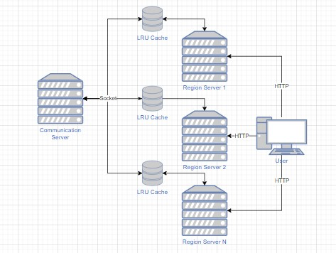
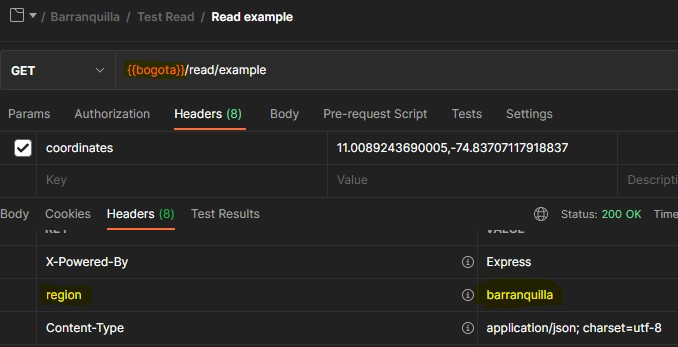

# Question 1: Intersect coordinates

Here is the algorithm:

```javascript
const pointIntersects = ([x1, x2], [x3, x4]) => x1 <= x4 && x2 >= x3;
```

## How to use it

1. Clone the project
2. Execute `npm install`
3. To view the test, execute `npm run test:questions`

# Question 2: String compare

Here is the algorithm:

```javascript
const compareStrings = (str1, str2) => {
    if(typeof str1 !== "string" || typeof str2 !== "string") {
        throw new Error("invalid");
    }

    return {
        "-1": "lower than",
        "0": "equals",
        "1": "greater than"
    }[str1.localeCompare(str2)];
};
```

If some param is not a string type, then return an error.

## How to use it

1. Clone the project
2. Execute `npm install`
3. To view the test, execute `npm run test:questions`

# Question 3: LRU Cache

I implemented a library on nodeJS with the next considerations:

1. The library counts with a socket server called communication server, to cast the data between servers. Also comunicate the location of the servers and other data.
2. When a LRUCache client lost connection with the main server, this will try to reconnect in an interval of time defined on an environment variable.
3. Every time a write is executed, this will send to the communication server, to cast to the other clients. If there are no connection, this will be saved on a queue while the connection is restored.
4. A method that validates where is the nearest server to a location.
5. A method that validates if the cache has expired.

This is a diagram about how the LRUCache library works integrated to a express server (for test using HTTP), but it can be integrate with any protocol.



The express server has a middleware that verify the region using a header called `coordinates` and redirect to the correct server. Also the response has a `region` header, that if it sends on the next request, then I won't verify the coordinates again.

This is an example of the request and response using postman:



Here we can look the request was generated on **bogota**, but was redirected to **barranquilla** and the `region` header was added.

## How to use it

1. Clone the project
2. Execute `npm install`
3. To execute the communication server, executes: `npm run communication`
4. To execute a regional server, executes: `npm run server:<region>` where `<region>` could be: barranquilla, medellin or bogota

## Considerations

* The redirect is only internal. If you want, you have to change the url manually. Also you have to add the `region` header to the request to avoid request the communication server.
* The `expiration` header is in milliseconds.
* You have to add `coordinates` header to validate the correct region.
* There is a folder called postman that contains a list of services and an environment for test purposes
* this project uses node 16.x or higher

## TODO: Improvements

- Add an identifier or using RPC to redirect the request to the correct server properly (concurrency to the same service).
- Implement a library like RxJS to add observers instead the improvised handler.
- Improve the system of expires, using a expiration stack instead of the recent only.
- Usea a Pub / Sub server (such as rabbitmq) to handle the replicate data system
- Improve the LRU library to handle binaries.
- If the server has no the requested key, ask to the neighbors if they have the data and propagate the changes.
- Using the public ip instead of coordinates to search the nearest server
- Add test and coverage for this project
